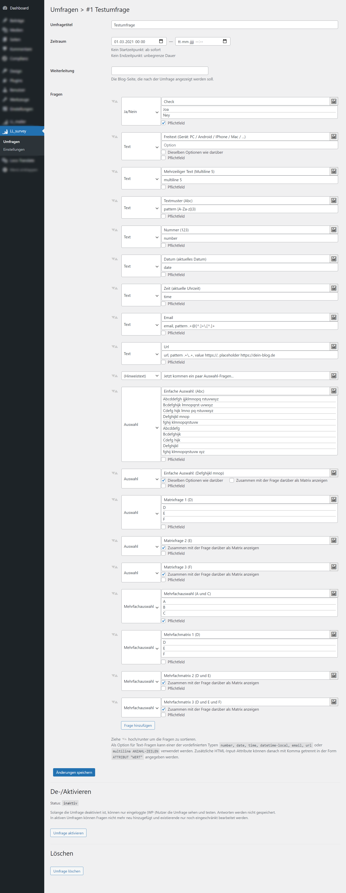
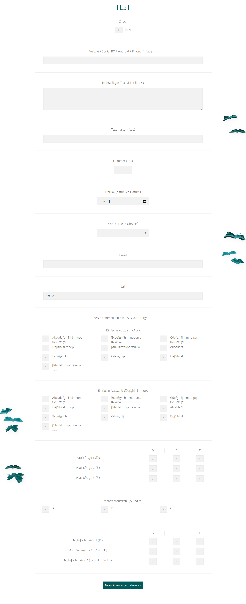

# LL_survey
*Wordpress survey plugin* (originally developed for [Linda liest](https://linda-liest.de))

###### Survey Creation
- Questions using text or any image via the media library.
- Question types:
  - *Text (single/multiline)* — Collect free text answers.
  - *Yes/No* — checked/unchecked input, e.g. if you want your participnats to acknowledge something.
  - *Single choice* — classic single choice with as many options as you like.
  - *Multiple choice* — s.a.
- Add some structure by including *instructions/tips* and *page breaks* inbetween the questions.
- (Re-)order questions simply via drag'n'drop.
- Optional datetime schedule for automatich activation and deactivation.
- Optional target page to redirect participants when finished.

###### Display on page
- Easy to include in any wordpress page or post via shortcode.
- Fine-grained CSS-class annotation for customization via your theme's CSS rules.

###### Data
- All data is stored in the wordpress database on your server.
- View survey answers directly from the admin area.
- Survey data can be exported as JSON or CSV files.

###### Create a survey

###### Test the survey
